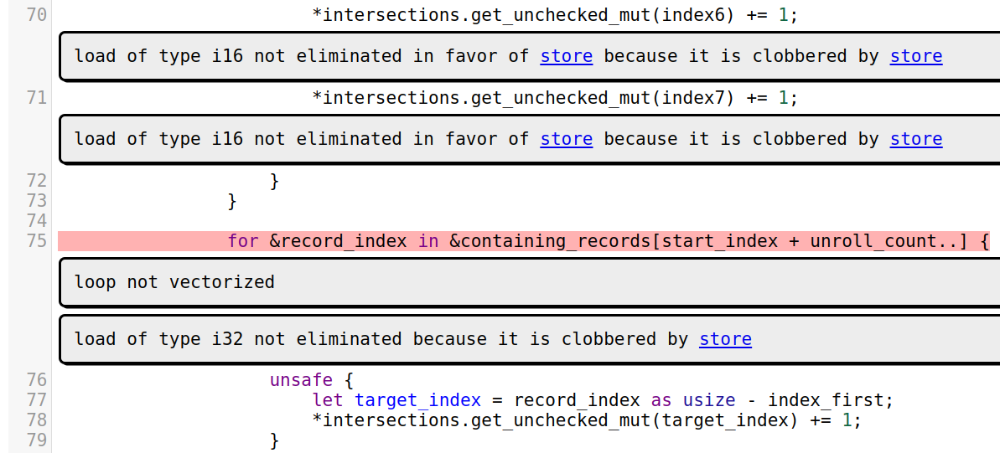

# `cargo-remark` [![Build Status]][actions] [![Latest Version]][crates.io]

[Build Status]: https://github.com/kobzol/cargo-remark/actions/workflows/check.yml/badge.svg
[actions]: https://github.com/kobzol/cargo-remark/actions?query=branch%3Amain
[Latest Version]: https://img.shields.io/crates/v/cargo-remark.svg
[crates.io]: https://crates.io/crates/cargo-remark

**Cargo subcommand that makes it possible to view LLVM [optimization remarks](https://llvm.org/docs/Remarks.html)
generated during the compilation of your crate.**

These remarks can tell you where and why has LLVM failed to apply certain optimizations. In certain cases[^1], you can use
this knowledge to change your code so that it optimizes better. In the future, I hope that `rustc` will be able to emit
its own, Rust-specific (MIR?) optimization remarks, but this is just an idea at this point.

[^1]: Currently, probably only if you are a LLVM expert.

`cargo remark` compiles your crate, generates LLVM remarks, and then parses them and visualizes them in a simple website.
It is parallelized, which is important for large programs, because there can be a lot of remarks and since they are in 
YAML, their parsing is not very fast.

# Generated output example


# Installation
```bash
$ cargo install cargo-remark
```

Note that `rustc` has [gained](https://github.com/rust-lang/rust/pull/113040) the ability to output LLVM optimization
remarks in the YAML format on 2. 7. 2023, and it is currently unstable. Therefore, you will need a recent nightly
version[^2] of the compiler to generate LLVM remarks.
```bash
$ rustup update nightly
```

[^2]: At least `nightly-2023-07-03-...`.

# Usage
`rustc` can generate LLVM remarks using the (currently unstable) `-Zremark-dir` flag, which is used internally by this
crate. To generate remarks from your crate, use the following command:
```bash
$ cargo remark build
```

After the build finishes, the remarks will be located in `target/remarks/yaml`, and the rendered website will be located
in `target/remarks/web`. You can open the website by pointing your web browser to `target/remarks/web/index.html` file,
or by using the `--open` flag.

This command will automatically build your crate with optimizations, so you don't have to pass the `--release` flag.
Currently, only missed optimization remarks will be visualized. `Analysis` and `Passed` remarks are ignored.

### CLI parameters
| **Flag**     | **Default**                                     | **Description**                                                   |
|--------------|-------------------------------------------------|-------------------------------------------------------------------|
| `--open`     | (unset)                                         | Open the generated website with the default browser.              |
| `--external` | (unset)                                         | Visualize remarks from external crates (dependencies) and stdlib. |
| `--filter`   | `FastISelFailure,NeverInline,SpillReloadCopies` | Comma separated list of remark passes that should be ignored.     |

### Features
There is currently a single feature `mimalloc`, which is enabled by default, and which enables the use of the
[mimalloc](https://docs.rs/mimalloc/latest/mimalloc/) allocator. To disable the feature, compile (or install) the crate
with `--no-default-features`.

## Rendering remarks from a directory
If you have a directory with YAML remarks on disk, and you just want to visualize them without invoking Cargo, you can
use the `analyze-remarks` binary, which comes with this crate.

```bash
$ analyze-remarks <yaml-dir> --source-dir <crate root>
```

When you use this tool, you need to manually pass the root source directory from where the remarks were generated
(with `cargo remark`, it is automatically inferred).

You could even use this binary to render remarks generated from C/C++ programs. One advantage of that is that `analyze-remarks`
will probably be much faster than [existing](https://github.com/OfekShilon/optview2) C/C++ remark tools, which are written
in Python.

## Usage with PGO
If you compile your crate with [Profile-guided optimization](https://doc.rust-lang.org/rustc/profile-guided-optimization.html)
(PGO), the generated remarks will contain "hotness", a measure of how important is each missed optimization remark. This
can help with prioritizing which remarks should be resolved first.

You can combine `cargo remark` with the [`cargo-pgo`](https://github.com/Kobzol/cargo-pgo) command to generate remarks
from a PGO optimized build:
```bash
# Compile with PGO instrumentation
$ cargo pgo build

# Gather PGO profiles
$ ./target/release/<target>/<binary> <workload>

# Compile with PGO optimizations and generate remarks
$ cargo remark wrap -- pgo optimize
```

# Related work
This crate, and especially the generated website was heavily inspired by [optview2](https://github.com/OfekShilon/optview2),
a tool for visualizing LLVM optimization remarks generated from C and C++ programs.

# License
[MIT](LICENSE)
